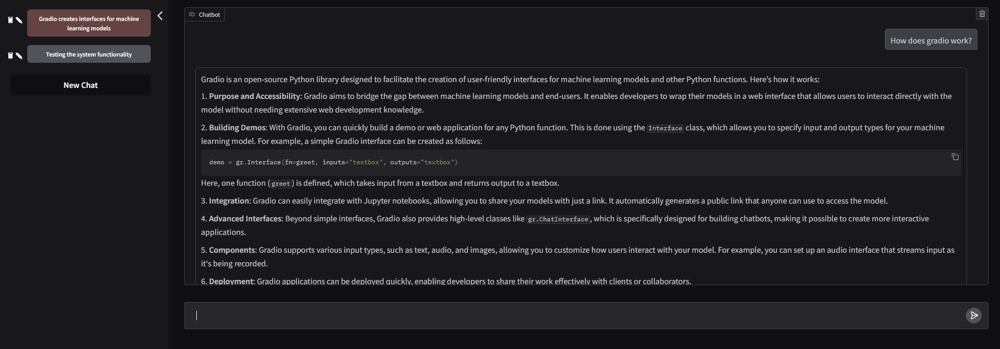

A template for chatbot streaming from langgraph with gradio

The template features history for the LLM, a couple tool calls, streaming output, tabs, persistence, and follow-up question buttons.

# Install

    pip install uv

Add your gemini api key to `.env`
Optionally add tavily key for websearch

# Run

    uv run app.py

